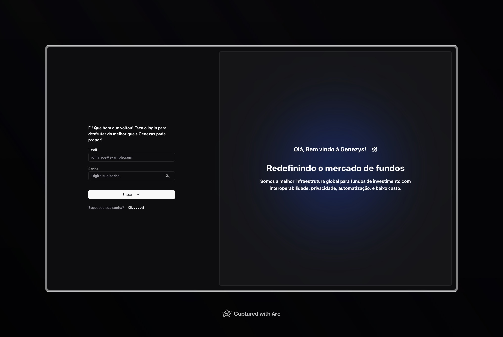
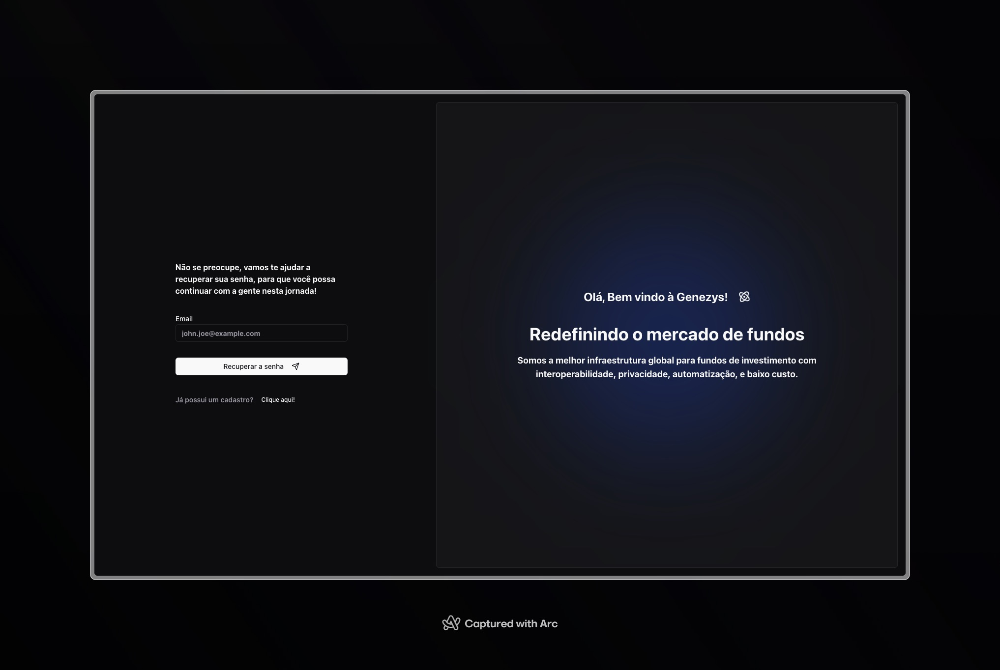
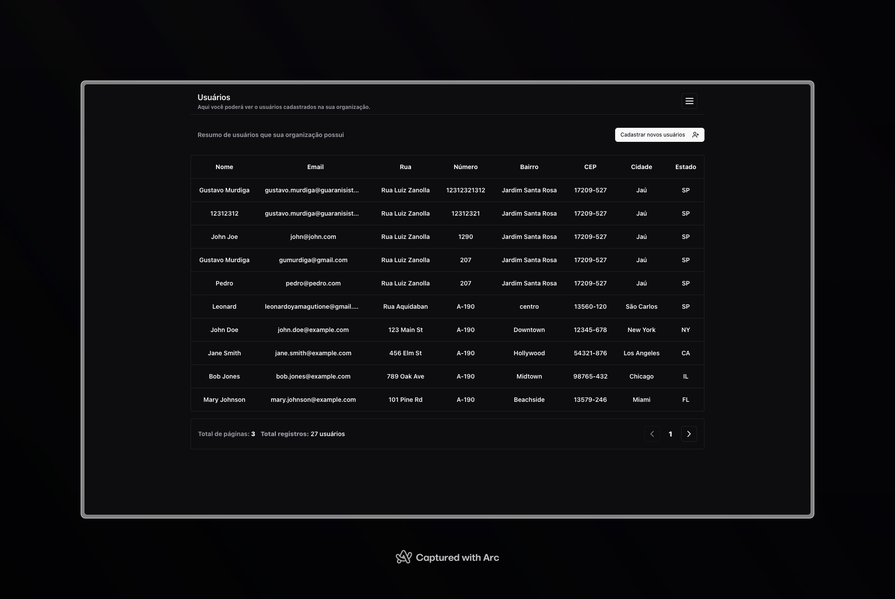
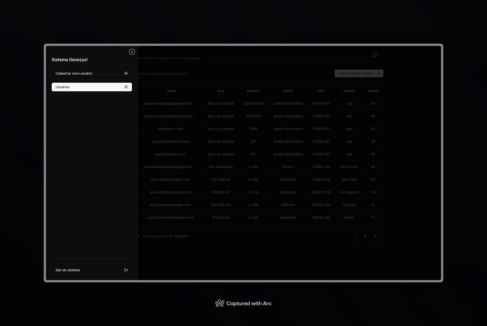
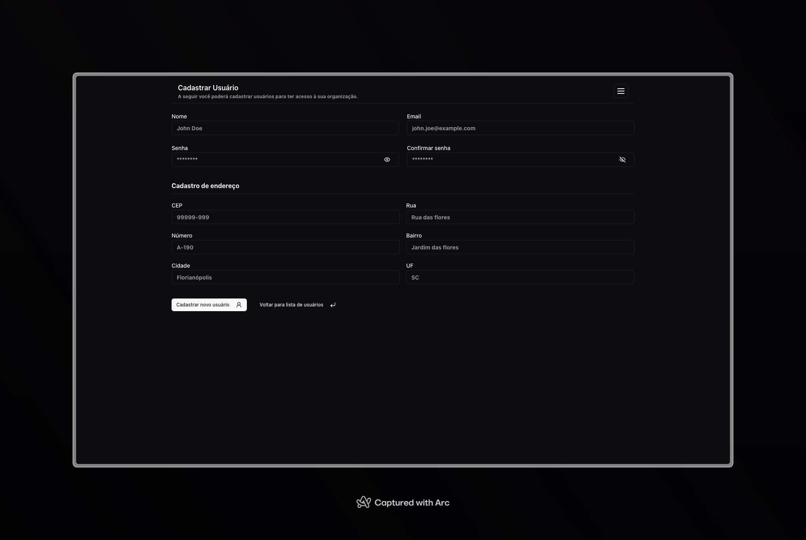

## Genezys front end

   Este projeto tem como intuito mostrar ao time de desenvolvimento da Genezys meus conhecimentos no desenvolvimento de sistemas web utilizando tecnologias como: 

  - ReactJS
  - NextJS
  - ContextAPI
  - TailwindCSS
  - Shadcnui
  
  ## Setup

  Para iniciar o projeto será necessário a instalação do Node em sua versão LTS e que você possua um gerenciador de pacotes que mais te agrade, neste projeto optamos por utilizar o <a href="https://pnpm.io/pt/">pnpm</a>.

  - Neste primeiro momento será necessário realizar o clone do repositório.
    Se você possuir a CLI do github instalada em sua máquina, você pode realizar o clone do projeto da seguinte forma.

  ```git 
    gh repo clone Gustavo-Murdiga88/genezys-front-end-test
  ```
   ou se preferir por SSH 

  ```git 
   git@github.com:Gustavo-Murdiga88/genezys-front-end-test.git
  ```

  - Após a execução do clone do projeto, você deve ir até a pasta raiz do projeto, executando
  ```shell
    cd genezys-front-end-test
  ```
  - Em seguida devemos instalar todas as dependências do projeto. Executando no terminal
  ```shell
    pnpm install
  ```
  ## Executando o projeto
    
  - Em seguida já podemos executar o projeto, executando em seu terminal o seguinte comando 
  ```shell
    pnpm run dev
  ```
  - Em seguida iremos ter um retorno em nosso terminal, e podemos acessar a aplicação na seguinte URL: http://localhost:3000
  
  - Ao acessar a url iremos encontrar a tela principal o app contempla as seguintes rotas.
   
  /signin

  

  /forgot-password

  

  /home
  

  /home - drawer aberto

  

  /register
  

  ## Agradecimentos

  Agradeço a Genezys pelo desafio, espero ter atendido os requisitos necessários esperados pela equipe. 
  
  Obrigado  🙏